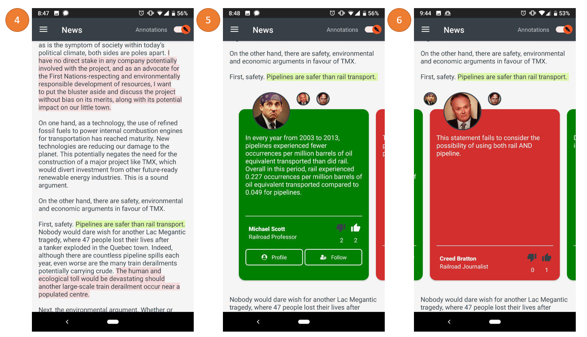

# Probo

Probo is a news annotation app which provides line by line news annotation and news and source reliability analysis using Natural Language Processing.

## Functionality

The screenshots below outline the functionality of the application.

Screenshot 1 - User Sign-in: It allows the user to either sign into an existing account or sign up for a new one. To create an account, the user must enter their email, name, and password. A user must be signed into an account to use the application.

Screenshot 2 - Landing Page: Like any news app, the landing page has a current list of top news articles. Note the “Alert” indicator appearing on the second article (bottom of the screenshot). It’s triggered by an AI model trained to detect potentially misleading (i.e. fake news) articles.

Screenshot 3 - App Navigation. Here, the user accesses their landing page, profile, feed, subscriptions, or their account settings page. The user may also sign out of their account from here.

Screenshot 4 - News Article Body. The demo article has been annotated and is therefore highlighted. Red highlights mean users disagree with the statement, and green means they agree. Any color in-between is proportional to the number of people who agree and disagree with the statement. The intensity of the highlight is proportional to the number of people that have annotated that sentence versus others in the article. The user may choose to toggle the highlights on or off using the switch in the top right corner of the screen.

Screenshots 5 & 6 - Inline Annotation. When users click on a highlighted sentence in the article, the paragraph splits to reveal all the annotations associated with that statement. Users can navigate between each annotation by swiping left or right. From here, users can up or downvote the annotation, or click to go to the annotator’s profile page. They can also follow that annotator to receive notifications of their future annotations. Any annotations made by Followed annotators show up in the “Feed” page under the hamburger menu. Following the sentence highlight format, a red annotation card indicates the annotator disagrees with the statement, and a green card means they agree.

Screenshots 7, 8, and 9 - Annotation Input. When the user long-presses a sentence in the article, the annotation input screen pops up. Here, the user is asked to indicate, using a slider, the level to which they deem it true or false. Below that they can input their argument and a source link to support their claim. If the user is a primary source in the article, they can tick the box to bypass the outside source link requirement. Users can also tick a second box to subscribe to future annotations on that same sentence. These annotations appear in the user’s “Subscriptions” page, in the hamburger drop-down menu. At the top of the screen, the word “Fact” appears. This is populated by an AI model trained to determine whether the selected sentence is a fact or an opinion. If the statement is categorized as opinion, they are not required to provide a source. If the statement is a fact, they must provide a source that is relevant to the article. An AI model is used here to measure the source link’s relevancy to the article. If it falls below the predetermined threshold, the user is asked to provide another source.

Screenshot 10 - User Profile Page. All user annotations are listed here, where you can click to be taken directly to the specific article where that annotation was made.

Screenshot 11 - User Feed. Here, users can read any annotations made by the annotators they are following. By clicking these annotation, they are taken to the annotation as it appears within the location of the article.

Screenshot 12 - User Subscription Page. Here, users can follow future annotations made by other users on statements they have commented on (they can choose to subscribe while inputting their own annotation). As with the profile and feed pages, users can click an annotation to be taken to the specific location in the article.

## Overall Design

The block diagram of the app is shown below:

User Authentication: Firebase user authentication is used to verify user identity.
User input: User inputs include: authentication information, news annotations, upvote/downvote annotations, and follow/unfollow other users. Information provided by the user will be stored in the web-server.

UI: The user interface is the core component because it displays news articles, annotations, heatmaps, feed, and the profile page. Furthermore, the UI displays the elements required for the user input.

Web-server: A web-server based on Firebase handles storing and retrieving user data and annotations. User management and user-user interaction are done using Firebase Firestore. The notification system consists of a cloud function as well as integration with Firebase Messaging.

NLP (Natural Language Processing): Consists of two modules:
1. Tensorflow fake news detector model: This neural network flags articles that appear to be fake (e.g. see the second article in Screenshot 2). To represent the semantic relations between the meaning of the word, we used the Stanford GloVe 300-dimensional embedding matrix, which has a vocabulary of +400,000 words. A LSTM network architecture was used, consists of three LSTM layers (with 32, 64, and 128 units) followed by two dense layers with ReLU activation functions. The network was trained on a Kaggle dataset (https://www.kaggle.com/c/fake-news/data) which has +20k labeled real and fake news articles. 

2. IBM Watson Natural Language Understanding API: This API provides a text analysis tool through NLP, including concept tagging, keyword extraction, and sentiment analysis. The API has two purposes. First, to distinguish between fact and opinion sentences which is then used to modify the annotation input dialogs. Second, to verify if the source link provided is relevant to the context of the article being annotated. The former is achieved using the API’s sentiment analysis tool, and the latter is attained by extracting the top 20 keywords of both the source link and the annotated article, and comparing them using Jaro–Winkler distance function. If Jaro similarity of the keywords of the source and the article were greater than 90%, the source was assumed to be relevant to the article.

